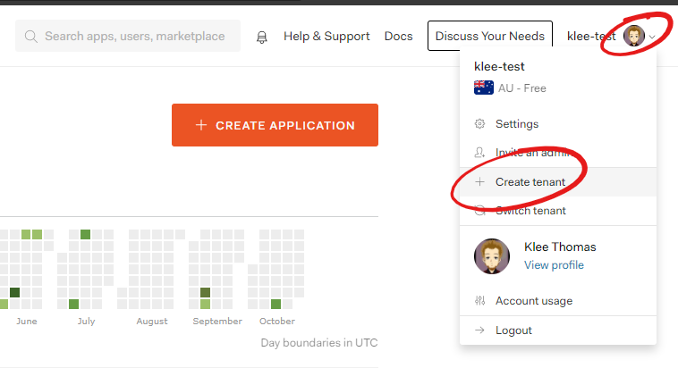
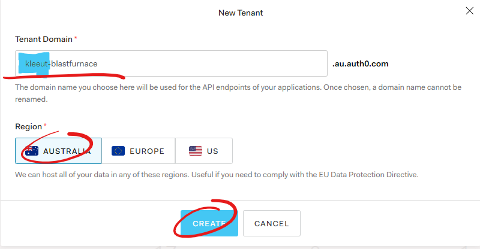
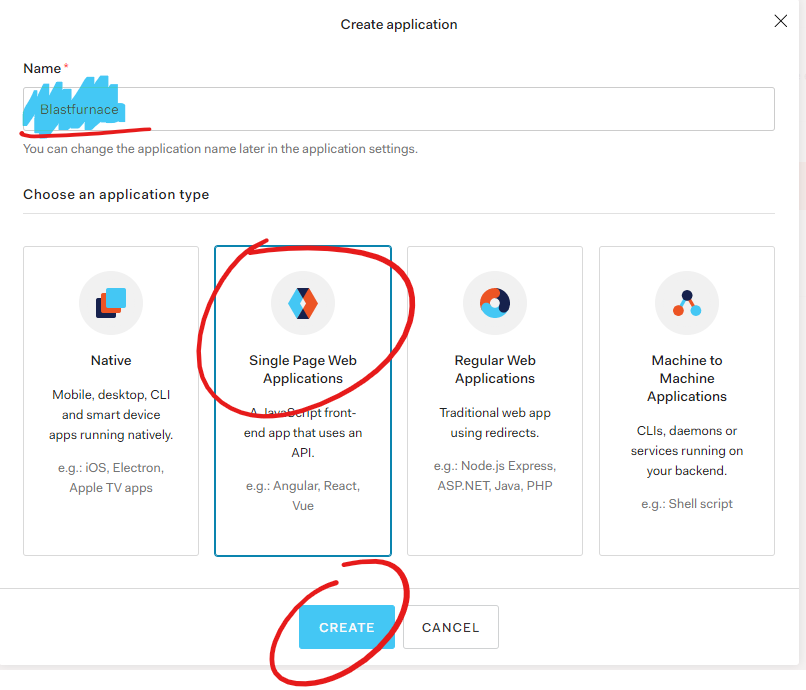
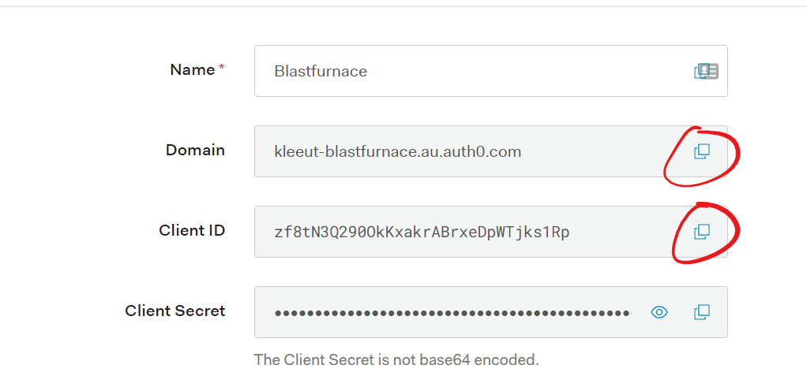
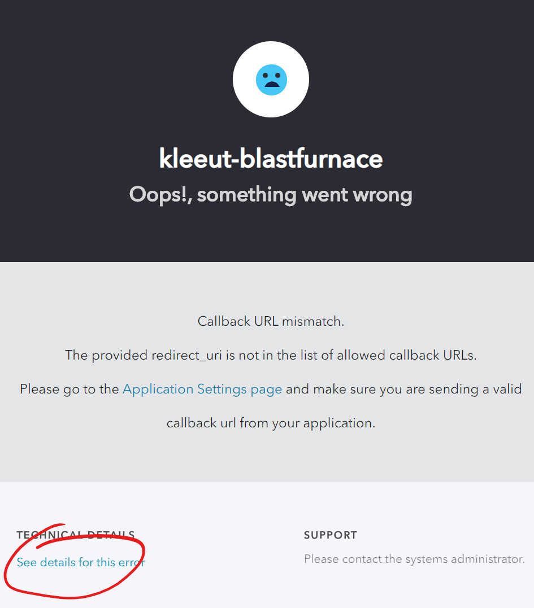
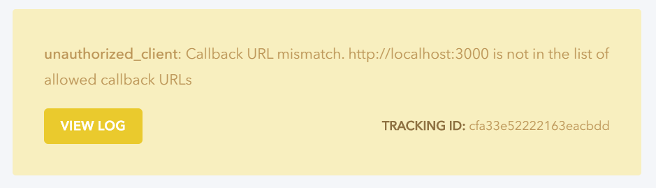
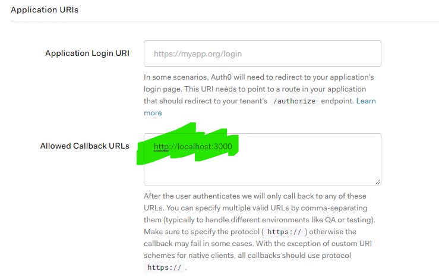

# Code

This is making use of the base code that is in the `Web` directory at the top of the repository.

# Try it out

We can try out the application straight away. The app is configured to use Klee's BlastFurnace Auth0 tenant.  
Navigate to the `Web` directory in a terminal of your choice `cd <path to repository>/Web`.

Install the dependencies by navigating to the directory and running `npm install`.
Start the dev server using `npm start`.  
Navigate to http://localhost:3000.
You can see a very basic page where you can log in, to Klee's Blast Furnace Auth0 tenant.

Click log in, and register for an account. Once you've registered you'll be redirected back to the page and see some basic details from Auth0.

Stop the development server and close the browser tab.

Let's get to using your own Auth0 environment.

# Looking at the React application code

First up lets have a look at the code to understand what it's doing.

This app was created using Create React App with the TypeScript template. After creation it has been hollowed out with the goal of showcasing how you can set up authentication using Auth0.

The key file is the [`App.tsx`](../App.tsx) file. This file contains all the TypeScript and TSX code to set up our minimal authentication experience.

For this workshop lets ignore all the rest.

## App.tsx

This part of the application is focused on the responsibilities around interacting with the user.

The display for the application is broken into 4 parts.

1. Login Status (in `LoginDisplay()`)
1. Login and Logout Buttons (in `LoginDisplay()`)
1. User data display (in `UserDisplay()`)
1. Auth0 Configuration (in `App()`)

Auth0 provides a `useAuth` hook and `Auth0Provider` context provider from the `@auth0/auth0-react` npm package. This hook provides a collection of functions and values that can be used to get information about the user and their authentication status.

### Login status

The first thing to know is if the user is authenticated and if there has been an error authenticating the user.

This is provided by the `isAuthenticated` and `error` properties respectively. For this example if there is one present we'll just write the error message out to the screen just incase we need it for debugging. We have the `.?` optional chaining operator taking care of checking if `error` is `null` or `undefined`. We'll also write out if we have a user logged in or not. We'll make better use of this property later.

```tsx
// Web > src > App.tsx > LoginDisplay
<p>Is Logged In : {isAuthenticated ? "yes" : "no"}</p>
<p>Error: {error?.message}</p>
```

### Login and Logout buttons

For this sample we want to provide a way for users to log in and log out.
We're making use of the `isAuthenticated` value from the `useAuth` hook to determine which button to show the user.

When the user clicks log in we call the `loginWithRedirect` function returned from `useAuth0`. This redirects the browser out to an external page where the user will be asked for their user name and password. This way our application never has to know about passwords.

Dont worry about logout for now. We'll set that up at the end of this section.

```tsx
// Web > src > App.tsx > LoginDisplay
{
  isAuthenticated ? (
    <button
      onClick={() => {
        /* Add logout function here */
      }}
    >
      Logout
    </button>
  ) : (
    <button
      onClick={() => {
        loginWithRedirect();
      }}
    >
      Login
    </button>
  );
}
```

### User data display

One of the reasons that we want a user to be able to log in is to know something about the user. Auth0 provides this by using the Open ID Connect protocol and providing data that it has stored about a user to the application.

The user display section of the page makes use of the state stored by the Auth0 SDK to show if the user is currently logged in. If they are show data about them from the identity token including their avatar curtesy of Gravatar. Auth0 loads this into the ID token and makes it available as the `user` object returned from `useAuth0`. This object doesn't have a defined shape. To show what is in it by default let's type it as a key value pair `{ [name: string]: string }`.

We have a dedicated component to render out the users data called `UserDisplay` which we call from the `LoginDisplay` component.

By default Auth0 reaches out to Gravatar to get an avatar for the user and makes this available under the `picture` key. Let's render this out as an image.

```tsx
// Web > src > App.tsx > UserDisplay

```

To show what else is in the token let's render a table of the keys and values.

```tsx
// Web > src > App.tsx > UserDisplay
<table>
  <thead>
    <tr>
      <th>key</th>
      <th>value</th>
    </tr>
  </thead>
  <tbody>
    {Object.keys(user).map((key) => (
      <tr key={key}>
        <td>{key}</td>
        <td>{user[key]}</td>
      </tr>
    ))}
  </tbody>
</table>
```

# Setup Auth0

Open [Auth0](https://auth0.com) and Log In or Sign Up.

Create a new Tenant by opening the tenant menu in the top right hand corner and selecting new tenant.



Enter a name for the new tenant. Tenants need to have unique names so for this enter `<yourname>-blastfurnace.`
Make sure that the tenant is located in Australia then click Create.


## Create a new application

Click `Applications` in the menu on the left hand side of the window.

Click the `+ CREATE APPLICATION` button to open the new application dialogue.

Set the name of the application to `Blastfunace` and select `Single Page Web Applications` as the application type.

Click `Create`.



## Configure the client

Copy the Client ID and domain from the Auth0 application into the code in `App.tsx`.

Paste them into their respective locations in the `Auth0Provider`. In the code you'll see Klee's details in there.

```tsx
// Web > src > App.tsx > App
<Auth0Provider
  domain="kleeut-blastfurnace.au.auth0.com" // replace with your domain
  clientId="zf8tN3Q290OkKxakrABrxeDpWTjks1Rp" // replace with your client id
  redirectUri={window.location.origin}
>
  {/* Render the login display */}
  <LoginDisplay />
</Auth0Provider>
```

Start the dev server again and open http://localhost:3000.

Click on Login.

This time there is an error page displayed.


Click on `See details for this error` and it will tell us that http://localhost:3000 is not in the list of allowed callback urls.


Having to specify the list of allowed login urls is an important security feature that stops someone setting up a phishing site that makes use of your login experience to log into their phishing site.

## Add the callback url

Back in the [Auth0 console](https://manage.auth0.com) open your BlastFurnace application again. Scroll down to the Application URLs section and add http://localhost:3000 to the Allowed Callback URLs text box.



Scroll to the bottom of the page and click the `SAVE CHANGES` button.

Go back to http://localhost:3000 in the browser and try logging in again.

# Add user Logout

The final step for this section is to implement the logout functionality.

Get the logout function from the `useAuth0` hook by adding it to the list of descructuring arguments.

```tsx
// Web > src > App.tsx > LoginDisplay
const {
  loginWithRedirect,
  user,
  isAuthenticated,
  isLoading,
  error,
  logout,
} = useAuth0();
```

Call the logout function in the `onClick` handler of the Logout button.

```tsx
// Web > src > App.tsx > LoginDisplay
<button
  onClick={() => {
    /* Add logout function here */
    logout();
  }}
>
  Logout
</button>
```

At the moment this will send us to a bit of an odd place. A blank page with just `OK` on it.
Auth0 wants us to tell it where to send the user after logging out. This is added as part of the options passed to `logout()`.
Update the code to send the user back to our dev server on logout.

```tsx
// Web > src > App.tsx > Login Display
<button
  onClick={() => {
    /* Add logout function here */
    logout({ returnTo: window.location.origin });
  }}
>
  Logout
</button>
```

Auth0 also needs us to give it a list of locations that a user is allowed to be redirected to after logging out.  
Back in the Auth0 console add `http://localhost:3000` to the Allowed Logout URLs textbox.

Now you should be able to log in and log out from the webpage.


