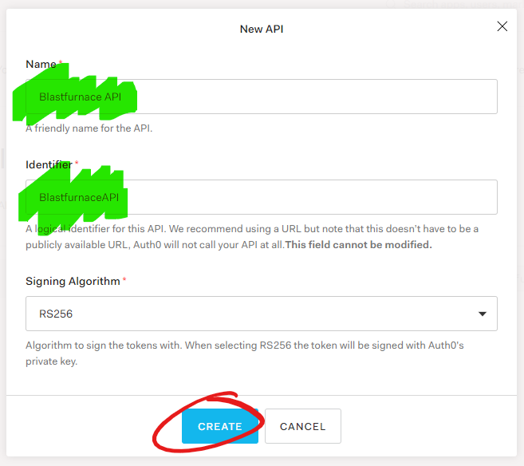
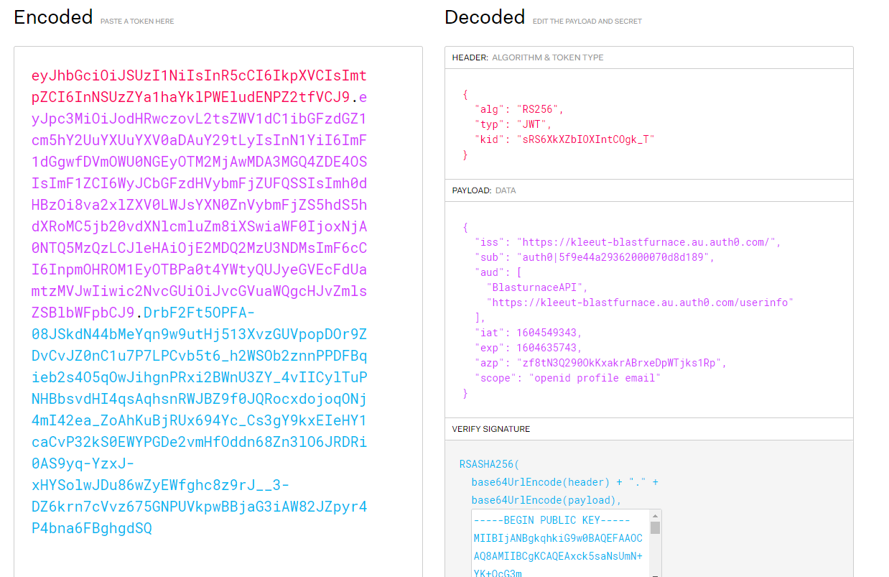

At the end of part 1 we have an Auth0 tenant set up with a React web app that can allow our users to log into the site and see some information about them. This covers off the first key thing of why we , understanding who a users is.

The second key reason that we want users to log in is so that we can use that authentication to provide them access to endpoints that we don't want to expose publicly.

This section will go through setting up an API in Auth0 and making use of it in the web client to get a JWT access token.

# Get an access token from the Auth0 SDK

We can get an access token from the Auth0 SDK without setting up and API in Auth0. It just wont be much use to us. Lets fetch it any way so we can see what it looks like before and after we set up our API.

Get the `getAccessTokenSilently` function from the `useAuth` hook output.

```tsx
// Web > src > App.tsx > LoginDisplay
const {
  loginWithRedirect,
  user,
  isAuthenticated,
  error,
  logout,
  getAccessTokenSilently,
} = useAuth0();
```

Let's add a new component to deal with displaying the access token for the user. Put this at the top level of our `App.tsx` file. You wouldn't usually show this to a user but we want to see that we've been able to get a token.

We'll call our new component `AccessTokenDisplay` and it will take the access token fetching function `getAccessTokenSilently` and the `isAuthenticatedProperty`.

```tsx
// Web > src > App.tsx
function AccessTokenDisplay(props: {
  getAccessTokenSilently: () => Promise<string>;
  isAuthenticated: boolean;
}): JSX.Element {}
```

The first thing we're going to need in this component is a state variable to store the access token. We'll make use of the React `useState` hook.

```tsx
// Web > src > App.tsx > AccessTokenDisplay
const [accessToken, setAccessToken] = useState("");
```

### Get the token

Because the `getAccessTokenSilently` function is asynchronous we'll need to wrap our component in a React `useEffect` hook and trigger it when the `isAuthenticated` variable changes. Add the following access token fetching `useEffect` block directly below the line that sets up the access token state.

```tsx
// Web > src > App.tsx > AccessTokenDisplay
useEffect(() => {
  async function getAccessToken() {
    if (!props.isAuthenticated) {
      return;
    }
    // Get the access token from Auth0
    const token = await props.getAccessTokenSilently();
    // Store the token and trigger a re-render
    setAccessToken(token);
  }
  // Run async access token fetching function
  getAccessToken();
  // Run only when the props.isAuthenticated variable changes
}, [props.isAuthenticated]);
```

### Display the token

The last part of our component is to setup some output so we can see the token we have retrieved. The code below sets up a basic display for the access token by rendering the access token into a text area. The text area control makes it easy to copy the token if we want to make use of it in an api testing tool.

```tsx
// Web > src > App.tsx > AccessTokenDisplay
return (
  <div>
    <h2>Access Token</h2>
    <label htmlFor="accessTokenBox">Access Token:</label>
    {/* Using a text area because it's easy to copy from */}
    <textarea
      id="accessTokenBox"
      value={accessToken}
      onChange={() => {
        // Don't allow input into the textarea
        setAccessToken(accessToken);
      }}
    ></textarea>
  </div>
);
```

### Understanding the token and why we need an Auth0 API

The token that we have rendered out looks something like `n5jmNIg7eNDbg4DlNB8mI00VJFocmbTt` this opaque value can be used to call Auth0 to get an identity token but we can't use it to protect an API. What we want is a JWT token that we can read values out of and validate that it's correct.

To get one of these we need to tell Auth0 about our the API we want to call.

# Setup the API in Auth0

Most of the work tha twe need to do to set up an API needs to be conducted in the [Auth0 console](https://manage.auth0.com).

Open the APIs menu on the left side navigation menu.
In the APIs view click the `+ CREATE API` button to open the new API dialogue.

In the New API dialogue give your api a name of `Blastfurnace API` and an identifier of `BlastfurnaceAPI`. The name can be changed but the identifier is fixed once you click create.



Open the settings page and copy the identifier. We'll use this identifier to configure the web app so we can get our JWT access token.

# Configure the web app

In the `App.tsx` file find the `App` function and we'll configure the `Auth0Provider` to make use of our API when logging into Auth0. We do this by providing an `audience` prop to the `Auth0Provider` tag. This `audience` prop's value needs to the the identifier we copied from the Auth0 console.

```tsx
// Web > src > App.tsx > App
<Auth0Provider
  domain=" Your Domain "
  clientId=" Your Client ID "
  redirectUri={window.location.origin}
  audience="BlastfurnaceAPI"
>
  {/* Render the login display */}
  <LoginDisplay />
</Auth0Provider>
```

Now when you click login again you'll see some different behaviour. First will be that you'll be asked to allow access. This will only happen while running on localhost, so don't worry your users wont see it.

Once you've clicked accept you'll notice that the access token is now substantially different. It's much longer and has a well defined shape. The token is divided into 3 sections separated by the `.` character.

# Validate our access token

To have a look at what is inside the token copy it out of the text box and paste it into the JWT debugger at [jwt.io](https://jwt.io)

In here you'll be able to see the header in the top of the right hand column. Notice the `alg` property is `RS256` which is the encryption we selected when creating our API.

In the payload section you can see that the properties are based on information we've setup in Auth0.

- The `iss` (issuer) field is the domain of our tenant.
- The `aud` (audience) property has an array of values including the API identifier we set up as the audience.
- The `azp` property is the client id of our application.


