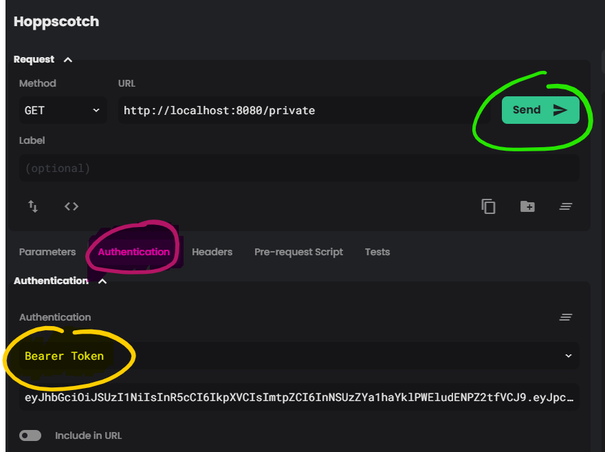

A key reason to authenticate users is to allow them to access to information that isn't available to the general public. This section will go through setting up an [ExpressJS](https://expressjs.com/) API with a protected endpoint that can only be called by a user authenticated against the Auth0 tenant we set up in the previous sections.

# API code

There is a starter project for this in the `API` directory.

## Setup

The project currently has a minimal set of dependencies to get express running in a TypeScript development environment.

The code is a single file `server.ts`. Inside this file we set up an express server with a single endpoint `/public` that returns `{hello:"world"}` to anyone who calls it and starts the server listening on `http://localhost:8080`.

You can start the server in watching mode by running opening a new terminal window in the `API` directory, installing the dependencies `npm install` and starting the dev server `npm run start:dev`.

Once the server has started navigate to [http://localhost:8080/public](http://localhost:8080/public) to test the server.

The development server is running in nodemon and will pick up changed that we make from here.

## Adding an authenticated endpoint

To protect an endpoint we're going to need to make sure that the API knows how to get an access token from a request and how to validate that, that token is valid.

Fortunately for us Auth0 has provided some open source packages that can take care of the undifferentiated heavy lifting for us.

Install the [express-jwt](https://github.com/auth0/express-jwt) and [jwks-rsa](https://github.com/auth0/express-jwt) packages.

```bash
npm install --save express-jwt jwks-rsa
```

### Configure the middleware

These two packages give us what we need to configure some express middleware that will run before our protected endpoint, validating the token and making it's contents available in a `user` object on the request.

First add the following import statements to bring in the functions we need from these packages.

```ts
// API > src > server.ts
import jwt from "express-jwt";
import { expressJwtSecret } from "jwks-rsa";
```

We need to configure the `expressJwtSecret` function to know how to retrieve the key that was used to sign the access token. Auth0 uses the JSON Web Key Set or JWKS standard to provide these keys.

Add the following code to the top of `server.ts` and update the `jwksUri` property with the endpoint for your Auth0 tenant. This follows the format `https://<TenantName>.au.auth0.com/.well-known/jwks.json`. If you'd rather copy it from the console it can be found in the [Auth0 console](https://manage.auth0.com) In the setting for your application there is a link saying `Show Advanced Settings` in here there is a tab titled `Endpoints` which includes a property called `JSON Web Key Set`

```ts
// API > src > server.ts
const jwksCallback = expressJwtSecret({
  cache: true,
  rateLimit: true,
  jwksRequestsPerMinute: 5,
  // JWKS url from the Auth0 Tenant
  jwksUri: "https://kleeut-blastfurnace.au.auth0.com/.well-known/jwks.json",
});
```

Below that add this code that makes use of our `jwksCallback` and configures the middleware that will be used to protect our private API endpoint. Update the `audience` and `issuer` properties to match your tenant and API audience. (note that the issues starts with `https://` and has a trailing `/`)

```ts
// API > src > server.ts
var jwtCheck = jwt({
  secret: jwksCallback,
  // The same audience parameter needs to be used by the client to configure their Auth0 SDK
  audience: "BlastfurnaceAPI",
  // The Auth0 domain
  issuer: "https://kleeut-blastfurnace.au.auth0.com/",
  // Has to be RS256 because that's what Auth0 uses to sign it's tokens. Allowing extras lowers security.
  algorithms: ["RS256"],
});
```

Finally add in the private endpoint with some secret information that shouldn't be publicly available.

```ts
// API > src > server.ts
// Require authenticated requests to access the /private route.
app.get("/private", jwtCheck, (req: Request & { user: any }, res: Response) => {
  // jwtCheck adds a user property with the payload from a valid JWT
  console.log(req.user);
  return res.json({
    secrets: [
      `You're ${JSON.stringify(req.user)}`,
      "          ... I'm Batman!",
    ],
  });
});
```

# Testing

Now we can test the endpoint and ensure that it's not available to just anyone.

For this you can make use of any of a number of tools. Lets use [Hopscotch](https://hoppscotch.io/)

## Without a token

Set the url to `http://localhost:8080/private` and click `Send` and the response will be a 401 status code.

## With a token

Now let's add a token, we can use the UI we set up in section 2 to get the token by logging in.
Copy the token out of the web page.
Open Hopscotch and find the `Authentication` tab.
Select `Bearer Token` as the authentication type.
Paste the token from the web view into the textbox.
Click Send.


This time the server will return a 200 response with the list of secrets and the contents of the user object.


